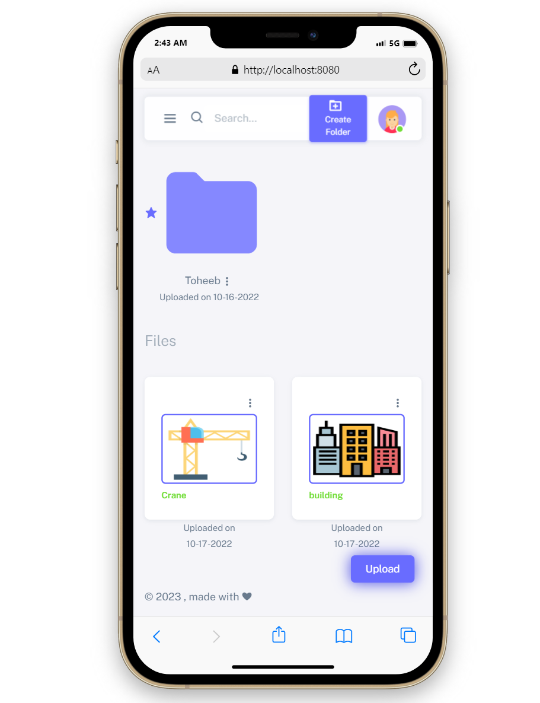
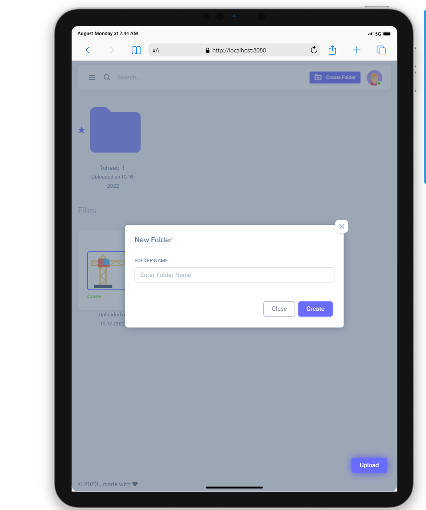
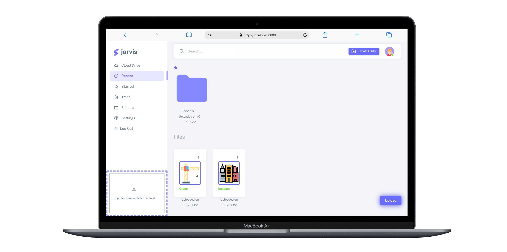

# Jarvis: The Secured Cloud Storage as a document management system

 

### Table of Contents
- [About](#about)
- [Features](#features)
- [About](#about)
- [Technologies](#technologies)

### About

Jarvis is a secured cloud storage application that is built with Java JSP. It allows users to upload a file through a two-step encryption algorithm(AES and RSA) that encrypts the uploaded file and keep them secured to only the user.

###  Features 🔎

* Authentication
* Upload file
* Recent files and folders
* File sorted by type
* Trash
* Favorite / Starred
* File encryption on upload
* File decryption on download

### Technologies 👨‍💻

* Java
* JSP
* Javascript
* HTML
* CSS
* Bootstrap
* Mysql
* Apache

### Screenshots 📱

### Connect with me 🗣️

